### CSS challenges - flags

#### featureset 1 - Indonesia
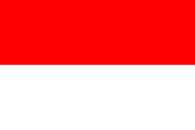
1. make sure you have a height on the parent.
1. give a % height to the children

#### featureset 2 - Indonesia
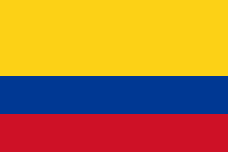
1. -

#### featureset 3 - Ireland
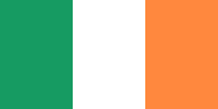
1. -

#### featureset 4 - France
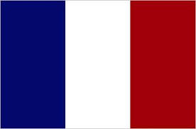
1. -

#### featureset 5 - Benin
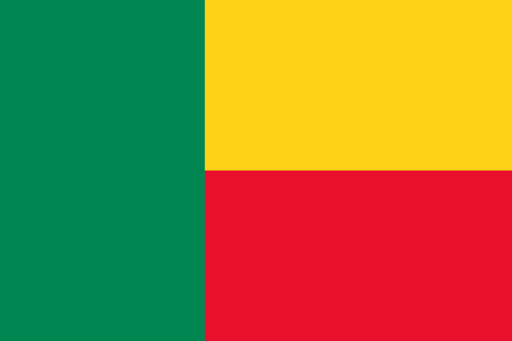
1. -

#### featureset 6 - Sweden
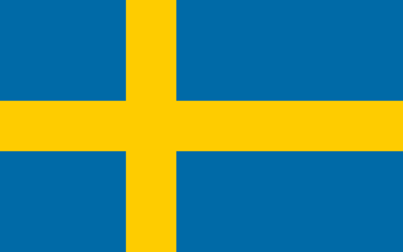
1. -

#### featureset 7 - Switzerland

1. -

#### featureset 8 - Tonga
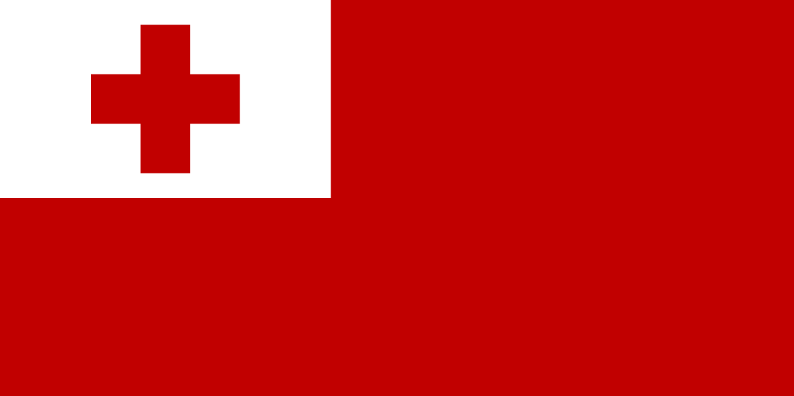
1. -

#### featureset 9 - Japan
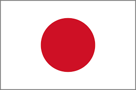
1. -

#### featureset 10 - Canada
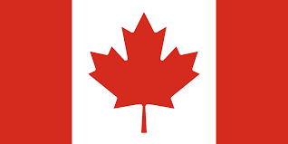
1. you'll use the image in your work: 

#### featureset 11 - Norway
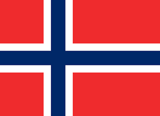
1. -

#### featureset 12 - Greece
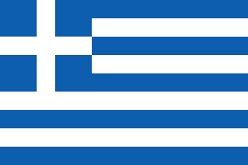
1. -

#### featureset 13 - Somalia
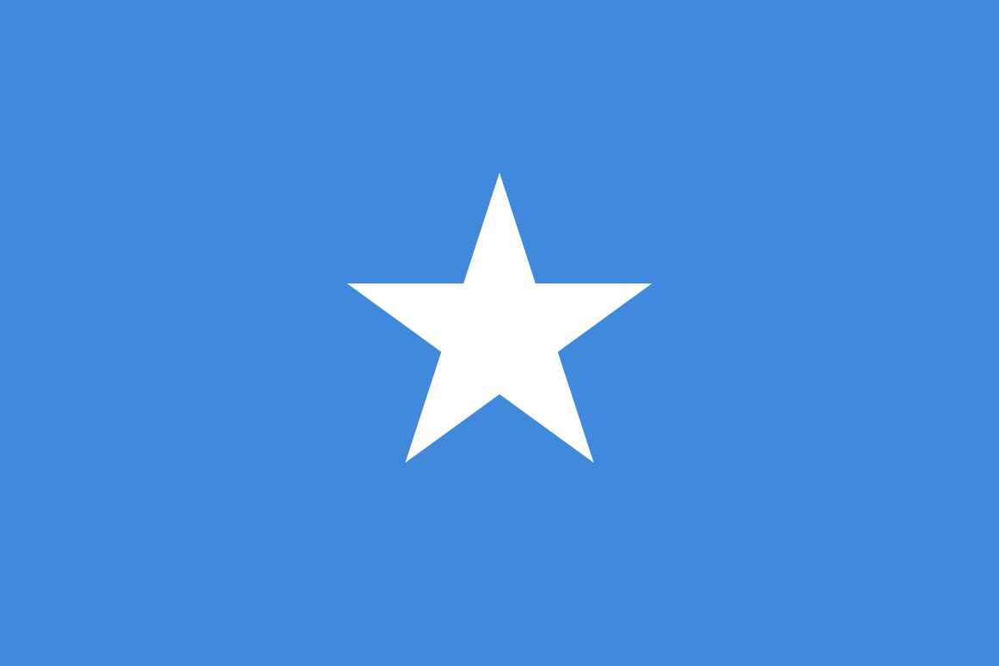
1. -

#### featureset 14 - Chile
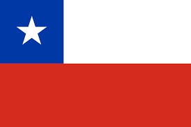
1. -

#### featureset 15 - Turkey
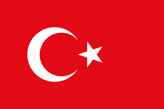
1. -

#### featureset 16 - China
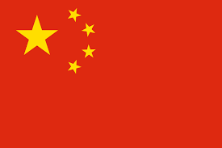
1. -

#### featureset 17 - Cuba
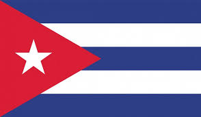
1. -

#### featureset 18 - Western Sahara

1. -

#### featureset 19 - Kuwait
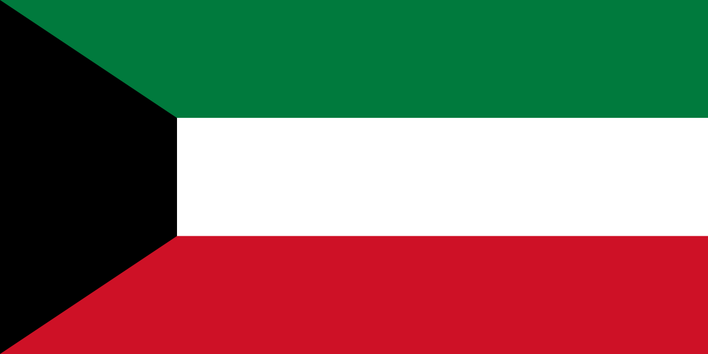
1. -

#### featureset 20 - Venezuela
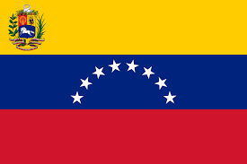
1. Use the following image for the logo 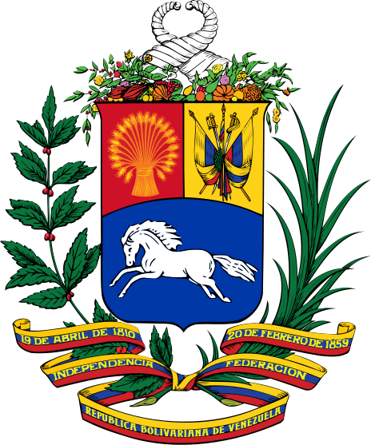

#### featureset 21 - Trinidad And Tobago
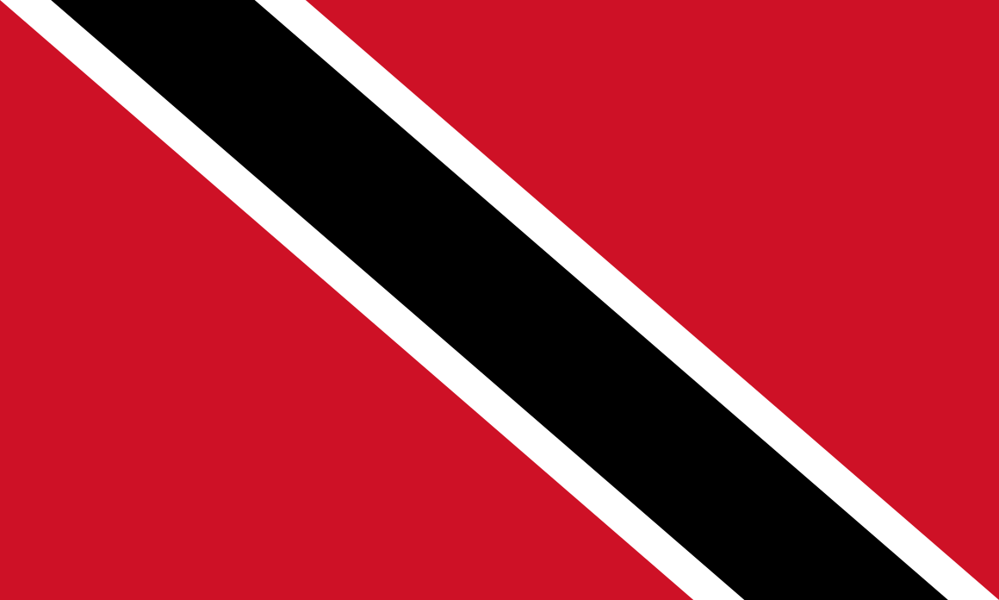
1. -

#### featureset 22 - United Kingdom
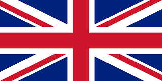
1. -

#### featureset 23 - New Zealand
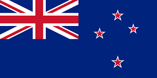
1. -

#### featureset 24 - United States
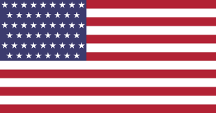
1. -

#### featureset 25 - Seychelle
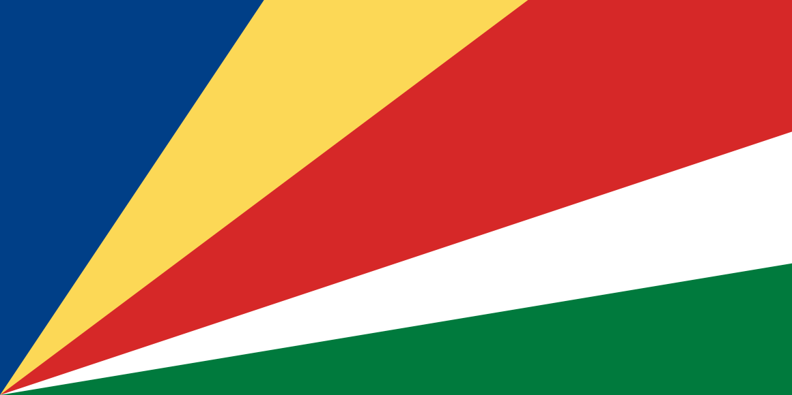
1. -