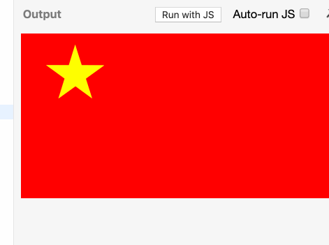
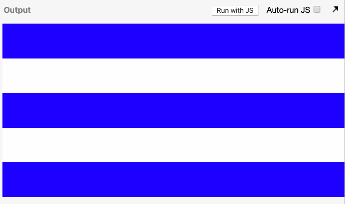

### CSS challenges - flags

#### featureset 1 - Indonesia

1. make a container element for the entire flag
1. put two horizontal elements
1. use px to set the height of the horizontal sections

#### featureset 2 - Indonesia

1. use % to set the height of the horizontal sections.  To make it work, you'll need to have the parent with either a fixed height, or a % of an eventual parent with a fixed height.  VH/VW/VMIN work as 'fixed' height.

#### featureset 3 - Ireland

1. use display: flex on the parent to make the children vertically next to each other.
1. use 100% width on the children and they will automatically size themselves to fit with their siblings.

#### featureset 4 - France

1. use display: inline-block to put the elements side by side
1. to get rid of the gaps between elements, use font-size: 0 to the parent

#### featureset 5 - Benin

1. now you will need two vertical containers, one for the green left panel, and one for the yellow/red panel.  Use float to put the two panels side by side
1. inside the yellow/red panels, put two containers  Give each of them a height

#### featureset 6 - Sweden

1. make two containers in the main container, and make each of them yellow
1. position the children absolutely so they are in the correct position
1. don't forget to put a non-static position on the parent element.

#### featureset 7 - Switzerland

1. make the main container for the flag
1. to make it square, give it a height and width of the same vmin
1. put another container inside the element to contain the white divs for the cross
1. use padding on the flag container to push the inner div further inside
1. use position absolute to make two divs inside the inner div for the +

#### featureset 8 - Tonga

1. make a container element for the flag
1. if you made the swiss flag with responsive units, all you will need to do now is paste the code for that flag into this flag and it will work!  If you didn't do responsive units, change them first in the swiss flag before putting them here!

#### featureset 9 - Japan

1. put the parent container as display: flex
1. put a child element in, make it a red background and give it a border-radius of 50%
1. give the child element margin: auto
1. you can also try it with the following on the child:
    1. position absolute on the child
    1. left and top to 50%
    1. transform: translate(-50%, -50%)

#### featureset 10 - Canada

1. you'll use the image in your work: 
1. make the underlying containers
1. add a class to the middle white section of the flag
1. for that css selector, add a pseudo element
    1. .someClass::before
    1. content: '' //put a letter there if you want to see it easier
    1. give it a height and width of 100%
    1. give it an absolute position, relative to the parent element
    1. give it a background image of the maple leaf
    1. rotate the pseudo-element with transform: rotateZ //the image is rotated, you'll need to counter rotate it to fit
    1. you'll need to set the background-size to contain
    1. you'll need to set the background-repeat property to not repeat

#### featureset 11 - Norway

1. in the main container, add two children containers
1. in each children container, add a new container
1. use position to get them in the right place

#### featureset 12 - Greece

1. make the cross in the top left as you have before with a container for it. position this absolutely in the top/left
1. make a container for the horizontal bars 
    1. put 9 elements in it, no need for a class
    1. select all the elements in the horizontal bar container, make them white
    1. with nth-child(odd), select only the odd children in the container and make them background color blue

#### featureset 13 - Somalia

1. use [html entities](https://www.toptal.com/designers/htmlarrows/symbols/).  Find the entity for star
1. make an element and put a star html entity inside it

#### featureset 14 - Chile

1. if you made your last one responsive, this should be no problem!

#### featureset 15 - Turkey

1. make a white circle element and position it appropriately.  use border-radius to get the circle
1. inside the white circle element, make a red circle element and position it such that it occludes the right side of the circle
1. position your star

#### featureset 16 - China

1. make a div for the star
1. make a small horizontal div, give it a background color so you can see it
1. put the star on the right side of the container
1. use transform-origin to change the rotation point of the div to the far left side
1. position the div so the left side is on the center of the star
1. rotate it from that point

#### featureset 17 - Cuba

1. use a similar technique for the horizontal bars as you did for the greek flag.
1. make a container for the red field
1. make the field about 50% height/width of the viewport width
1. use transform: translate to move it left off the side
1. use overflow: hidden on the parent to cut off the red square
1. rotate the red square.  you'll need to put it on the same transform as the translate
1. use skew to squeeze the red element
1. put a star in it, and counter rotate it

#### featureset 18 - Western Sahara

1. this is basically a combination of the turkey flag and the cuba flag

#### featureset 19 - Kuwait

1. this is the same concept as the background of the western sahara flag, except use z-index to adjust the height of the white element above the black element, and overlap the black element somewhat.

#### featureset 20 - Venezuela

1. Use the following image for the logo 

1. use the logo to the flag like you did with canada's flag.
1. use the star rotation method you used with the Chinese flag, but centered on the center of the flag

#### featureset 21 - Trinidad And Tobago

1. use rotation and nested elements

#### featureset 22 - United Kingdom

1. make the flag container have overflow: hidden
1. add an element for the horizontal and vertical bars, and add children to them to add the red inside each
1. repeat the following for the diagonal elements.

#### featureset 23 - New Zealand

1. if you made your UK flag elements responsive, you can add the same CSS to the inset portion of the NZ flag.
1. add elements for white stars, and inside each, put a red star

#### featureset 24 - United States

1. the bars you have done before
1. for the stars, make a container for each row
1. use nth-child to push in every other row

#### featureset 25 - Seychelle

1. combine rotation and skew to get the colors of this colorful flag